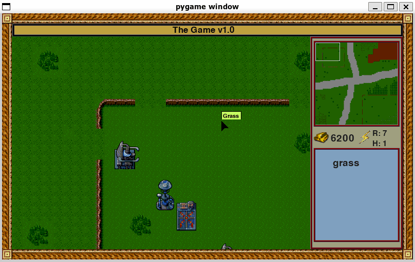

# Simple RTS Game

A pygame project to learn pathing and simple game mechanics



## Setup

Ideally use [pyenv](https://github.com/pyenv/pyenv) , as this project needs to be run at python version < 3 
* Create a pyenv virtualenv for the dependencies

```bash
pyenv virtualenv simple-rts-venv
```
* Install Dependencies
```bash
pip install -r requirements.txt
```
* Run the demo
```bash
python main.py
```

## License
[MIT](https://choosealicense.com/licenses/mit/)
